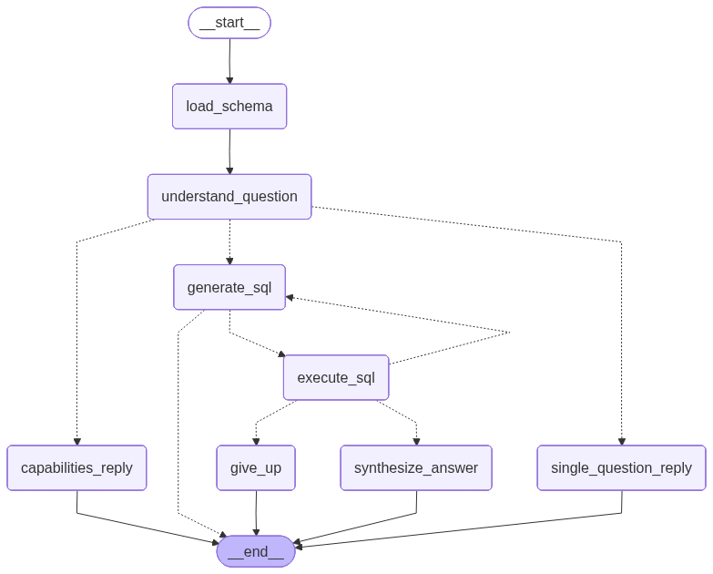
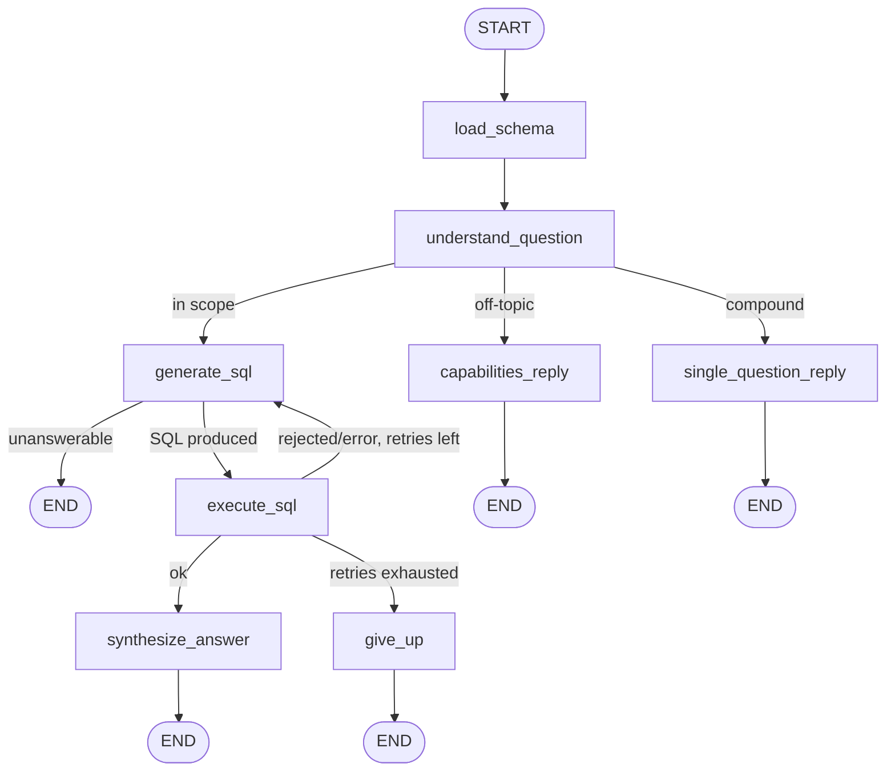

# Design

Two parts: first a **map of the agent graph** (the nodes, the edges, and when each edge fires), so
the rest of the document has something concrete to point at; then the **design decisions** — *why*
the system is built the way it is.

## Agent graph: nodes and edges

The agent is an orchestrated [LangGraph](https://langchain-ai.github.io/langgraph/) state machine
(see [§5](#5-you-must-be-able-to-see-why-it-answered-as-it-did) for why an explicit graph rather
than a free-running loop). One question enters at `START`; exactly one terminal node produces the
`answer` and the run ends. The compiled topology lives in
[`graph.py`](src/university_agent/graph.py); the node bodies and routing functions in
[`nodes.py`](src/university_agent/nodes.py).

*Rendered directly from the compiled graph (`build_graph().get_graph().draw_mermaid_png()`), so it
can't drift from the code.* The labeled source below adds the branch conditions and renders inline
on GitHub:

### Nodes — what each one does

| Node | LLM? | Role |
|---|---|---|
| **`load_schema`** | no | Fetches the current user's *accessible* schema from the MCP server. Deterministic — the schema is already scoped server-side to what this user may see ([§1](#1-a-user-must-never-see-data-which-they-are-not-allowed-to-see)), so this is the only view of the data the rest of the graph ever gets. |
| **`understand_question`** | yes | The relevance/scope gate. Decides `in_scope` (is this answerable from the university data at all?) and `is_compound` (is it really several separate questions?), and rewrites the question into a precise, schema-grounded form. This is where a confident-wrong-answer is headed off ([§4](#4-a-confident-wrong-answer-is-worse-than-an-honest-refusal)). |
| **`generate_sql`** | yes | Writes one read-only `SELECT` grounded in the scoped schema and example queries — or sets `answerable=false` with a reason when the data isn't present/accessible. On a retry it also receives the prior failed attempts as feedback. |
| **`execute_sql`** | no | Runs the SQL through the MCP server (scope-enforced, read-only, validated). Records the result; on failure appends the SQL+error to `history` for the next retry. |
| **`synthesize_answer`** | yes | Turns the result rows into a concise, factual natural-language answer. The only place free-text is generated from data. |
| **`capabilities_reply`** | no | Terminal. Canned reply for off-topic questions, explaining what the agent *can* answer. |
| **`single_question_reply`** | no | Terminal. Canned "one question at a time" reply for compound questions. |
| **`give_up`** | no | Terminal. Graceful reply after SQL retries are exhausted, surfacing the last error. |

### Data flow — how state moves through the graph

There are no hidden channels: every node communicates through one shared
[`AgentState`](src/university_agent/state.py) — a `TypedDict(total=False)` that acts as a
blackboard. A node receives the current state, does its work, and returns a *partial* dict;
LangGraph merges those keys back in. Most fields are last-write-wins; the one exception is
`history`, declared `Annotated[list[Attempt], operator.add]`, so each failed attempt is **appended**
rather than overwritten — which is exactly what lets `generate_sql` see every prior mistake on a
retry. Keeping `sql` and `result` in state (instead of buried inside tool calls) is also what makes
the run legible end to end in a trace ([§5](#5-you-must-be-able-to-see-why-it-answered-as-it-did)).

The run is seeded at invocation with `{question, user_id, attempt_num: 0}`. From there each node
reads a few fields and writes a few:

| Node | Reads from state | Writes to state |
|---|---|---|
| `load_schema` | `user_id` | `schema_text` (scoped to the user) |
| `understand_question` | `question`, `schema_text` | `reasoning`, `in_scope`, `is_compound`, `normalized_question` |
| `generate_sql` | `normalized_question`, `schema_text`, `history`, `attempt_num` | `attempt_num` (+1), then either `sql` **or** a terminal `answer` (unanswerable) |
| `execute_sql` | `user_id`, `sql` | `result`; on failure **appends** `{sql, error}` to `history` |
| `synthesize_answer` | `normalized_question`, `result` | `answer` |
| `capabilities_reply` | — | `answer` (off-topic canned reply) |
| `single_question_reply` | — | `answer` (compound canned reply) |
| `give_up` | `history` (last error) | `answer` (graceful failure) |

The conditional edges route purely on values already in state — `in_scope` / `is_compound`
(`route_after_understand`), whether `generate_sql` produced `sql` or a terminal `answer`
(`route_after_generate`), and `result.status` vs. `attempt_num`/`MAX_ATTEMPTS` (`route_after_execute`,
default `MAX_ATTEMPTS = 3`). So control flow and data flow are the same thing: the state carries
both the data and every decision that data drove. The retry loop (`execute_sql → generate_sql`)
makes the agent self-correcting; the `MAX_ATTEMPTS` bound stops a bad question from looping forever
— both motivated in [§4](#4-a-confident-wrong-answer-is-worse-than-an-honest-refusal).

---

## Design decisions

This half explains *why* the system is built the way it is. It is organized the way the
decisions were actually made: start from what was **critical** as a product/business concern,
then derive the **technical decision** that supports it. The architecture is the sum of these
"critical → supporting decision" pairs, not a list of technologies picked in isolation.

The TL;DR, then one section per concern.

| What was critical (product/business) | Technical decision it drove |
|---|---|
| A user must never see data they are not allowed to see | Deterministic, server-side row-level security — never in the LLM's hands |
| The data contract must stay stable while the implementation changes | `schema.sql` as the authoritative contract; SQLite→Postgres portable; data swappable behind it |
| No lock-in to one database or one LLM vendor | DB-agnostic boundary via MCP (CI-enforced); provider-agnostic LLM factory |
| A confident wrong answer is worse than an honest refusal | Scope/compound gate, graceful decline, capped self-correction, verifiable answers |
| You must be able to see *why* it answered as it did | Orchestrated LangGraph (explicit nodes, not an opaque loop) + end-to-end tracing |
| Results must be reproducible so changes can be compared | Committed fixture dump, deterministic seed, fixed eval set |

---

## 1. A user must never see data which they are not allowed to see

> While not explicitly requested in the task, this decision drove critical parts of the design.

**Why it's critical.** This is the trust foundation of the whole system. A student seeing another
student's grades, a teacher seeing a class they don't own, or anyone reaching a column they have no
right to — none of these is a bug, it's the failure the product exists to prevent. Note the framing:
not merely "another *user's* data" but **any data the user is not authorized for** — which spans
cross-user, cross-role, and column-level access. Access control therefore cannot be best-effort, and
it cannot depend on an LLM "deciding" to behave. It has to be a guarantee that holds *regardless of
what the model generates.*

**The technical decision: deterministic, server-side row-level security — defense in depth.**

- **Identity is resolved server-side; the LLM never sees the `user_id`.** The agent injects the
  authenticated identity into each MCP call as data. The model only ever sees a schema and writes
  SQL against it — it has no knowledge of *who* it is querying as, so it cannot leak across users
  even if it tries.
- **Per-user TEMP views, built by rule, not by the agent.** On each scoped connection the server
  creates TEMP views that expose only the rows the user may see, and the base tables are never
  reachable through the query path. The view-building is rule-based code, not an LLM call — so the
  boundary is the same on every request.
- **Read-only connection.** The SQLite connection is opened in read-only mode (`mode=ro`), so even
  a hypothetical destructive statement cannot mutate anything.
- **SQL validation (sqlglot AST).** Before execution, the SQL is parsed and checked: exactly one
  read-only `SELECT`, against an allowlist of accessible relations. Anything else is rejected with
  a category, not executed.

These layers are independent: each one alone would block unauthorized access; together they make a
leak structurally impossible rather than merely unlikely. The eval includes adversarial
access-control cases, and **no model leaked across any of them** — because the scope is enforced
below the model, the model's quality is irrelevant to safety.

## 2. The data contract must stay stable while the implementation changes

**Why it's critical.** The schema is the one thing everything else is written against — the
agent's queries, the tests, the eval. If "the data layer" meant "whatever SQLite happens to do
today," every upstream component would be coupled to an implementation detail. What the business
needs is a *stable contract*; what the implementation does behind that contract should be free to
evolve (different engine, different seed, real data instead of fixtures) without anyone upstream
noticing.

**The technical decision: `schema.sql` as the authoritative, portable contract.**

- `src/university_db/ddl/schema.sql` is the single source of truth — 7 tables with FK / UNIQUE /
  CHECK constraints. The SQLAlchemy models mirror it, and a test applies the SQL then exercises
  the models, so **drift fails the suite**.
- The DDL is standard enough to run on SQLite today and Postgres unchanged tomorrow — the contract
  is the SQL surface, not the engine.
- The data behind the contract is swappable: a deterministic generated seed, a committed fixture
  dump, or (in principle) a production database — all satisfy the same contract.

## 3. No lock-in to one database or one LLM vendor

**Why it's critical.** This is a system that will outlive its first technology choices. Tying the
agent's logic to SQLite, or to one model vendor, would make the two riskiest dependencies
(the data store and the model) the hardest to change. Both need to be replaceable.

**The technical decision: two clean boundaries.**

- **DB-agnostic agent boundary, enforced by CI.** The agent reaches data *only* through the MCP
  server over JSON-RPC; it has **zero** database imports (no `sqlalchemy`, no DB package). This is
  not a convention — the CI matrix builds the agent component *without* the DB dependencies, so an
  accidental import fails the build. The database could be replaced entirely behind the MCP server
  and the agent would not change.
- **Provider-agnostic LLM factory.** `make_llm()` builds the model from config (`LLM_PROVIDER` /
  `LLM_MODEL`) via `init_chat_model`, defaulting to local Ollama (`gemma2:9b`, free, no key) and
  switchable to Anthropic or OpenAI by setting env vars. The graph never names a vendor.

## 4. A confident wrong answer is worse than an honest refusal

**Why it's critical.** For a question-answering system over real records, a fabricated or
out-of-scope answer stated confidently erodes trust faster than an honest "I can't answer that."
The system has to know the limits of what it should answer, and fail gracefully when it hits them.

**The technical decision: gate, decline, self-correct, and verify.**

- **Scope + compound gate.** The `understand_question` node (see
  [the graph map](#agent-graph-nodes-and-edges)) judges whether a question is in scope and whether
  it is actually several separate questions; its routing sends off-topic asks to
  `capabilities_reply` and compound asks to `single_question_reply` ("one question at a time")
  rather than guessing.
- **Capped self-correction.** The `execute_sql → generate_sql` retry edge feeds the failed SQL and
  its error back to the model and retries up to `MAX_ATTEMPTS`, then routes to `give_up` gracefully
  instead of looping or fabricating.
- **Verifiability.** The web app's god-mode data browser and the eval both let answers be checked
  against ground truth, so "is it actually right?" is a question we can answer, not assume.

## 5. You must be able to see *why* it answered as it did

**Why it's critical.** A system you can't inspect is a system you can't trust, debug, or improve.
For both development and any future operation, it has to be possible to trace a question through to
its answer and see every decision in between.

**The technical decision: an orchestrated graph plus end-to-end tracing.**

- **Orchestrated LangGraph over an opaque ReAct loop.** The pipeline is the explicit nodes and
  named conditional edges mapped in [Agent graph](#agent-graph-nodes-and-edges) above. Each step is
  a place you can read, test, and reason about, versus a free-running agent loop whose path is
  hard to predict or explain.
- **Structured state.** The state carries the question, reasoning, generated SQL, results, and
  attempt history as typed fields, so every node's contribution is visible.
- **Two layers of tracing.** LangSmith traces every run end to end (tagged with role/user) when
  configured, and the repo also commits JSON execution traces so the per-node flow is inspectable
  with no key and no external service.

## 6. Results must be reproducible so changes can be compared

**Why it's critical.** "Did this change make the agent better or worse?" can only be answered if
the dataset and the test set are fixed. Without reproducibility, every eval is measuring noise.

**The technical decision: fix the dataset and the test set.**

- **Committed fixture dump.** `evals/fixture.sql` is a byte-for-byte SQL dump — the same dataset on
  every machine, independent of seed logic or library versions. (The generated seed is reproducible
  *within* one environment but its exact values track the installed Faker version, so the dump is
  the cross-machine reference.)
- **Fixed eval set.** 50 cases across 7 topics, scored per-topic and total at temperature 0, so two
  models — or two versions of the agent — are compared on identical inputs.
